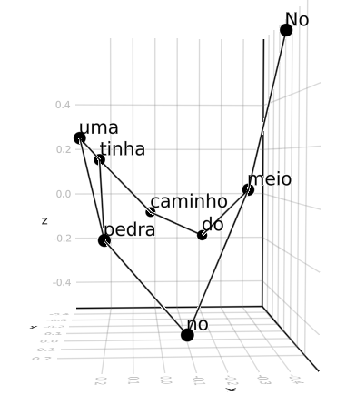

# TextGraphs
<!---
[](https://fargolo.github.io/TextGraphs.jl/stable)
-->  
[](https://fargolo.github.io/TextGraphs.jl/dev)
[](https://github.com/fargolo/TextGraphs.jl/actions/workflows/CI.yml?query=branch%3Amain)
[](https://codecov.io/gh/fargolo/TextGraphs.jl)


# Introduction
`TextGraphs.jl` offers Graphs representations of Text, along with natural language proccessing (NLP) functionalities.  

It is inspired by SpeechGraphs(https://repositorio.ufrn.br/jspui/handle/123456789/23273). Julia uses multiple dispatching, focusing on modular functions and high-performance computing.  
There's an object-oriented  by .  




---  

# Quick introduction  

Check the  for further information.   

## Install  

Install with Pkg.  
```julia
pkg>add TextGraphs
```

## Features  

### Graph types  

You can build the following graphs from text (`AbstractString`):  

Raw  
- Naive (`naive_graph`) uses the original sequence of words.  
- Phrases Graph(`phrases_graph`): Uses the original sequence of phrases.  

POS, Stems and Lemmas  
- Stem (`stem_graph`) uses stemmed words.    
- Lemma (`lemma_graph`): Uses lemmatized words.  
- Part of Speech Graph (POS, `pos_graph`) uses syntactical functions. 

Latent space embeddings
- Latent space embedding (LSE) graphs.  

### Properties  

You can obtain several properties of the graphs:  

Direct measures  
`graph_props` returns values of density, # of self loops, # of SCCs, size of largest SCC, and mean centrality (betweeness, closeness and eigenvector methods).  

Erdős–Rényi ratios  
`rand_erdos_ratio_props` returns values of density and mean centrality ratios between the graph and a random Erdõs-Rényi graph with identical number of vertices and edges.  


## Usage  

```julia
julia>using TextGraphs  
julia>naive_graph("Sample for graph")  
{3, 2} directed Int64 metagraph with Float64 weights defined by :weight (default weight 1.0)  
julia>stem_graph("Sample for graph";snowball_language="english") # Optional keyword argument  
{3, 2} directed Int64 metagraph with Float64 weights defined by :weight (default weight 1.0)  
julia> graph_props(naive_graph("Sample for graph"))
Dict{String, Real} with 7 entries:
  "mean_close_centr"        => 0.388889
  "size_largest_scc"        => 1
  "num_strong_connect_comp" => 3
  "density"                 => 0.333333
  "num_self_loops"          => 0
  "mean_between_centr"      => 0.166667
  "mean_eig_centr"          => 0.333335
```  

## Plot

```julia
using GraphMakie , GLMakie

g = naive_graph("Colorless green ideas sleep furiously")
stem_g = stem_graph("No meio do caminho tinha uma pedra tinha uma pedra no meio do caminho")

g_labels = map(x -> get_prop(naive_g,x,:token), collect(1:nv(naive_g)))
stem_g_labels = map(x -> get_prop(stem_g,x,:token), collect(1:nv(stem_g)))
graphplot(naive_g,nlabels=g_labels)
graphplot(stem_g,nlabels=stem_g_labels)

spec3_layout = Spectral(dim=3)
graphplot(naive_g,node_size=30,nlabels=g_labels,layout=spec3_layout)
```

## To do

- [ ] Graphs from LSA embeddings and metric from diffusion models.    
- [ ] Write a separate package to download and load copora (Corpora.jl) for internal usage.  
- [ ] Write a separate package with wrapper for NLP features (UDPipe.jl ?) in R and Python. See .  
- [ ] Tag within NLP packages in juliapackages.com.  
- [ ] Sample Erdõs-Rényi ratios.  
